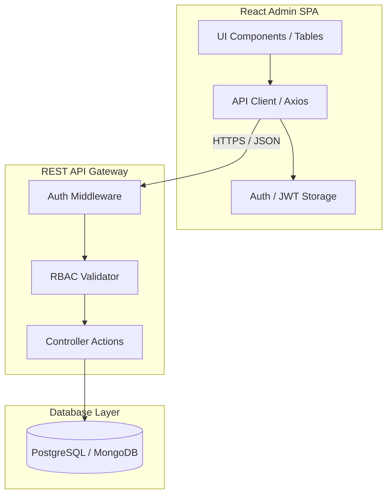

# E-Commerce Admin Panel: Backend Integration & API Specification

This document details the backend architecture, database schemas, and RESTful API endpoints required to migrate the client-side state of the UK E-commerce Admin Panel to a production-ready persistent backend.

---

## 1. Architectural Overview

The current frontend relies on static local state initialized from `seedData.js` and managed via React's `useState` hook in [App.jsx](../src/App.jsx). 

To support multiple administrators, ensure real-time consistency, and implement secure business logic, a dedicated backend service is required.



---

## 2. Entity Relationship Diagram (ERD)

Below is the relational database model design representing the core objects in the system:

```mermaid
erDiagram
    USERS {
        string id PK
        string name
        string email UK
        string password_hash
        string role "Super Admin | Store Manager | Customer Support | etc."
        string status "Active | Inactive"
        string avatar_url
        datetime created_at
    }
    
    PRODUCTS {
        string id PK
        string name
        string sku UK
        string barcode
        string category_id FK
        string brand_id FK
        text description
        text ingredients
        text nutrition_facts
        text storage_instructions
        string country_of_origin
        string_array images
        string video_url
        string seo_title
        string seo_description
        string status "Published | Draft"
        decimal regular_price
        decimal sale_price
        decimal cost_price
        string tax_class
        string weight
        string pack_size
        string color
        int stock
        int min_stock
        int max_stock
        int reorder_level
        string warehouse_location
        string supplier
        decimal rating
        int reviews_count
    }

    CATEGORIES {
        string id PK
        string name
        string parent_id FK
        text description
        string icon_url
        int display_order
        string status "Active | Inactive"
    }

    BRANDS {
        string id PK
        string name
        string logo_url
        text description
        string website
        boolean featured
        string status "Active | Inactive"
    }

    CUSTOMERS {
        string id PK
        string name
        string email UK
        string phone
        text address
        decimal lifetime_value
        int rewards_points
        string status "Active | Disabled"
        date joined_date
    }

    CUSTOMER_ADDRESSES {
        string id PK
        string customer_id FK
        string label "Home | Office | etc."
        text address_text
    }

    WISHLIST_ITEMS {
        string id PK
        string customer_id FK
        string product_id FK
    }

    CART_ITEMS {
        string id PK
        string customer_id FK
        string product_id FK
        int quantity
    }

    ORDERS {
        string id PK
        string customer_id FK
        string customer_name
        string customer_email
        datetime order_date
        decimal subtotal
        decimal discount
        decimal tax
        decimal delivery_fee
        decimal total
        string payment_status "Paid | Unpaid | Refunded"
        string delivery_status "New Order | Confirming | Picking | Packing | Ready | Out for Delivery | Delivered | Cancelled"
        string payment_method
        string tracking_number
        text shipping_address
        string assigned_driver_id FK
    }

    ORDER_ITEMS {
        string id PK
        string order_id FK
        string product_id FK
        string name
        int quantity
        decimal price
    }

    ORDER_TIMELINE {
        string id PK
        string order_id FK
        string status
        datetime timestamp
        text description
    }

    COUPONS {
        string id PK
        string code UK
        string type "Percentage | Fixed Amount | Free Shipping | Buy X Get Y"
        decimal value
        int usage_limit
        int used_count
        date start_date
        date end_date
        decimal min_order
        string_array categories
        string_array brands
        string status "Active | Expired | Inactive"
    }

    DRIVERS {
        string id PK
        string name
        string phone
        string vehicle
        string status "Active | Inactive"
        string active_order_id FK
        decimal rating
        decimal latitude
        decimal longitude
    }

    RECIPES {
        string id PK
        string title
        string cooking_time
        string nutrition
        text ingredients_text
        text steps_text
        string_array linked_product_ids
        string image_url
        string seo_title
        string seo_description
    }

    BLOGS {
        string id PK
        string title
        string slug UK
        string author
        string category
        string featured_image_url
        text content
        string seo_title
        string seo_description
        string status "Published | Draft"
        date published_date
    }

    AUDIT_LOGS {
        string id PK
        datetime timestamp
        string user_name
        string action
        string module
        text detail
    }

    CUSTOMER ||--o{ CUSTOMER_ADDRESSES : "has"
    CUSTOMER ||--o{ WISHLIST_ITEMS : "has"
    CUSTOMER ||--o{ CART_ITEMS : "has"
    CUSTOMER ||--o{ ORDERS : "places"
    CATEGORIES ||--o{ PRODUCTS : "contains"
    CATEGORIES ||--o{ CATEGORIES : "parent"
    BRANDS ||--o{ PRODUCTS : "manufactures"
    ORDERS ||--|{ ORDER_ITEMS : "contains"
    ORDERS ||--o{ ORDER_TIMELINE : "logs"
    DRIVERS ||--o{ ORDERS : "assigned-to"
```



---

## 3. Database Schema Models (SQL DDL & Types)

To establish the backend persistence database layer, use the following PostgreSQL table declarations (DDL) and matching TypeScript schema types.

### 3.1 SQL DDL (PostgreSQL Schema)

```sql
-- Enums for state control
CREATE TYPE user_role AS ENUM ('Super Admin', 'Store Manager', 'Customer Support', 'Warehouse Staff', 'Marketing Team');
CREATE TYPE common_status AS ENUM ('Active', 'Inactive', 'Disabled');
CREATE TYPE product_status AS ENUM ('Published', 'Draft');
CREATE TYPE payment_status AS ENUM ('Paid', 'Unpaid', 'Refunded');
CREATE TYPE order_status AS ENUM ('New Order', 'Confirming', 'Picking', 'Packing', 'Ready', 'Out for Delivery', 'Delivered', 'Cancelled');
CREATE TYPE coupon_type AS ENUM ('Percentage', 'Fixed Amount', 'Free Shipping', 'Buy X Get Y');

-- 1. Categories Table
CREATE TABLE categories (
    id VARCHAR(50) PRIMARY KEY,
    name VARCHAR(100) NOT NULL,
    parent_id VARCHAR(50) REFERENCES categories(id) ON DELETE SET NULL,
    description TEXT,
    icon_url VARCHAR(255),
    display_order INT DEFAULT 1,
    status common_status DEFAULT 'Active',
    created_at TIMESTAMP DEFAULT CURRENT_TIMESTAMP
);

-- 2. Brands Table
CREATE TABLE brands (
    id VARCHAR(50) PRIMARY KEY,
    name VARCHAR(100) NOT NULL,
    logo_url VARCHAR(255),
    description TEXT,
    website VARCHAR(255),
    featured BOOLEAN DEFAULT FALSE,
    status common_status DEFAULT 'Active',
    created_at TIMESTAMP DEFAULT CURRENT_TIMESTAMP
);

-- 3. Products Table
CREATE TABLE products (
    id VARCHAR(50) PRIMARY KEY,
    name VARCHAR(255) NOT NULL,
    sku VARCHAR(100) UNIQUE NOT NULL,
    barcode VARCHAR(100),
    category_id VARCHAR(50) REFERENCES categories(id) ON DELETE RESTRICT,
    brand_id VARCHAR(50) REFERENCES brands(id) ON DELETE RESTRICT,
    description TEXT,
    ingredients TEXT,
    nutrition_facts TEXT,
    storage_instructions TEXT,
    country_of_origin VARCHAR(100),
    images TEXT[] NOT NULL DEFAULT '{}',
    video_url VARCHAR(255),
    seo_title VARCHAR(150),
    seo_description VARCHAR(255),
    status product_status DEFAULT 'Draft',
    regular_price DECIMAL(10, 2) NOT NULL DEFAULT 0.00,
    sale_price DECIMAL(10, 2) NOT NULL DEFAULT 0.00,
    cost_price DECIMAL(10, 2) NOT NULL DEFAULT 0.00,
    tax_class VARCHAR(50) DEFAULT 'Standard (10%)',
    weight VARCHAR(50),
    pack_size VARCHAR(100),
    color VARCHAR(50),
    stock INT NOT NULL DEFAULT 0,
    min_stock INT DEFAULT 0,
    max_stock INT DEFAULT 1000,
    reorder_level INT DEFAULT 10,
    warehouse_location VARCHAR(100),
    supplier VARCHAR(255),
    rating DECIMAL(2, 1) DEFAULT 0.0,
    reviews_count INT DEFAULT 0,
    created_at TIMESTAMP DEFAULT CURRENT_TIMESTAMP
);

-- 4. Users Table
CREATE TABLE users (
    id VARCHAR(50) PRIMARY KEY,
    name VARCHAR(100) NOT NULL,
    email VARCHAR(100) UNIQUE NOT NULL,
    password_hash VARCHAR(255) NOT NULL,
    role user_role NOT NULL DEFAULT 'Warehouse Staff',
    status common_status DEFAULT 'Active',
    avatar_url VARCHAR(255),
    created_at TIMESTAMP DEFAULT CURRENT_TIMESTAMP
);

-- 5. Customers Table
CREATE TABLE customers (
    id VARCHAR(50) PRIMARY KEY,
    name VARCHAR(100) NOT NULL,
    email VARCHAR(100) UNIQUE NOT NULL,
    phone VARCHAR(50),
    address TEXT,
    lifetime_value DECIMAL(10, 2) DEFAULT 0.00,
    rewards_points INT DEFAULT 0,
    status common_status DEFAULT 'Active',
    joined_date DATE NOT NULL DEFAULT CURRENT_DATE
);

-- 6. Orders Table
CREATE TABLE orders (
    id VARCHAR(50) PRIMARY KEY,
    customer_id VARCHAR(50) REFERENCES customers(id) ON DELETE SET NULL,
    customer_name VARCHAR(100) NOT NULL,
    customer_email VARCHAR(100) NOT NULL,
    order_date TIMESTAMP DEFAULT CURRENT_TIMESTAMP,
    subtotal DECIMAL(10, 2) NOT NULL,
    discount DECIMAL(10, 2) DEFAULT 0.00,
    tax DECIMAL(10, 2) DEFAULT 0.00,
    delivery_fee DECIMAL(10, 2) DEFAULT 0.00,
    total DECIMAL(10, 2) NOT NULL,
    payment_status payment_status DEFAULT 'Unpaid',
    delivery_status order_status DEFAULT 'New Order',
    payment_method VARCHAR(100),
    tracking_number VARCHAR(100),
    shipping_address TEXT NOT NULL,
    assigned_driver_id VARCHAR(50)
);

-- 7. Order Items Table
CREATE TABLE order_items (
    id SERIAL PRIMARY KEY,
    order_id VARCHAR(50) REFERENCES orders(id) ON DELETE CASCADE,
    product_id VARCHAR(50) REFERENCES products(id) ON DELETE RESTRICT,
    name VARCHAR(255) NOT NULL,
    quantity INT NOT NULL CHECK (quantity > 0),
    price DECIMAL(10, 2) NOT NULL
);

-- 8. Order Timeline Table
CREATE TABLE order_timeline (
    id SERIAL PRIMARY KEY,
    order_id VARCHAR(50) REFERENCES orders(id) ON DELETE CASCADE,
    status VARCHAR(100) NOT NULL,
    timestamp TIMESTAMP DEFAULT CURRENT_TIMESTAMP,
    description TEXT
);

-- 9. Coupons Table
CREATE TABLE coupons (
    id VARCHAR(50) PRIMARY KEY,
    code VARCHAR(50) UNIQUE NOT NULL,
    type coupon_type NOT NULL,
    value DECIMAL(10, 2) DEFAULT 0.00,
    usage_limit INT DEFAULT 0,
    used_count INT DEFAULT 0,
    start_date DATE NOT NULL,
    end_date DATE NOT NULL,
    min_order DECIMAL(10, 2) DEFAULT 0.00,
    categories VARCHAR(100)[] DEFAULT '{}',
    brands VARCHAR(100)[] DEFAULT '{}',
    status common_status DEFAULT 'Active'
);
```

### 3.2 Frontend/Backend TypeScript Schema Definitions

```typescript
export interface User {
  id: string;
  name: string;
  email: string;
  role: 'Super Admin' | 'Store Manager' | 'Customer Support' | 'Warehouse Staff' | 'Marketing Team';
  status: 'Active' | 'Inactive' | 'Disabled';
  avatar?: string;
  createdAt?: string;
}

export interface Product {
  id: string;
  name: string;
  sku: string;
  barcode?: string;
  category: string;
  subCategory?: string;
  brand: string;
  description?: string;
  ingredients?: string;
  nutritionFacts?: string;
  storageInstructions?: string;
  countryOfOrigin?: string;
  images: string[];
  videoUrl?: string;
  seoTitle?: string;
  seoDescription?: string;
  status: 'Published' | 'Draft';
  regularPrice: number;
  salePrice: number;
  costPrice: number;
  taxClass: string;
  weight?: string;
  packSize?: string;
  color?: string;
  stock: number;
  minStock: number;
  maxStock: number;
  reorderLevel: number;
  warehouseLocation?: string;
  supplier?: string;
  rating?: number;
  reviewsCount?: number;
}

export interface Category {
  id: string;
  name: string;
  parent: string | null;
  description?: string;
  icon?: string;
  displayOrder: number;
  status: 'Active' | 'Inactive';
}

export interface OrderTimelineItem {
  status: string;
  time: string;
  desc: string;
}

export interface OrderItem {
  productId: string;
  name: string;
  qty: number;
  price: number;
}

export interface Order {
  id: string;
  customerName: string;
  customerEmail: string;
  date: string;
  items: OrderItem[];
  subtotal: number;
  discount: number;
  tax: number;
  deliveryFee: number;
  total: number;
  paymentStatus: 'Paid' | 'Unpaid' | 'Refunded';
  deliveryStatus: 'New Order' | 'Confirming' | 'Picking' | 'Packing' | 'Ready' | 'Out for Delivery' | 'Delivered' | 'Cancelled';
  paymentMethod: string;
  trackingNumber?: string;
  address: string;
  timeline: OrderTimelineItem[];
}
```

---

## 4. REST API Endpoints & Request/Response Specification

All request/response payloads are in JSON format. Authenticated routes require an `Authorization: Bearer <JWT_TOKEN>` header.

### 4.1 Authentication & Profile
| Method | Endpoint | Description | Request Body | Response (Success) | RBAC Roles |
| :--- | :--- | :--- | :--- | :--- | :--- |
| `POST` | `/api/auth/login` | Authenticate user & get JWT | `{ email, password }` | `{ token, user: { id, name, email, role, status, avatar } }` | Public |
| `GET` | `/api/auth/me` | Retrieve active session user | None | `{ id, name, email, role, status, avatar }` | Authenticated |
| `POST` | `/api/auth/logout`| Invalidate current token | None | `{ message: "Logged out successfully" }` | Authenticated |

#### Example Login Payload Details
**`POST /api/auth/login` Request:**
```json
{
  "email": "Admin@demo.com",
  "password": "SecurePassword123"
}
```

**`POST /api/auth/login` Response (200 OK):**
```json
{
  "token": "eyJhbGciOiJIUzI1NiIsInR5cCI6IkpXVCJ9.eyJpZCI6InVzci0xIiwibmFtZSI6Ik11Z2VzaCIsImVtYWlsIjoiQWRtaW5AZGVtby5jb20iLCJyb2xlIjoiU3VwZXIgQWRtaW4ifQ...",
  "user": {
    "id": "usr-1",
    "name": "Mugesh",
    "email": "Admin@demo.com",
    "role": "Super Admin",
    "status": "Active",
    "avatar": "https://images.unsplash.com/photo-1507003211169-0a1dd7228f2d?auto=format&fit=facearea&facepad=2&w=256&h=256&q=80"
  }
}
```

### 4.2 User Management
| Method | Endpoint | Description | Request Body | Response (Success) | RBAC Roles |
| :--- | :--- | :--- | :--- | :--- | :--- |
| `GET` | `/api/users` | List admin & staff users | None | `[{ id, name, email, role, status, avatar }]` | Super Admin, Store Manager |
| `POST` | `/api/users` | Add new system user | `{ name, email, password, role, status }` | `{ id, name, email, role, status }` | Super Admin |
| `PUT` | `/api/users/:id` | Update user details or role | `{ name, email, role, status, avatar }` | `{ id, name, email, role, status }` | Super Admin |
| `DELETE` | `/api/users/:id` | Remove user (or deactivate) | None | `{ message: "User deleted" }` | Super Admin |

### 4.3 Products & Inventory
| Method | Endpoint | Description | Request Body | Response (Success) | RBAC Roles |
| :--- | :--- | :--- | :--- | :--- | :--- |
| `GET` | `/api/products` | Query products (paginated, with search & filters) | Query params: `page, limit, search, category, status` | `{ data: [...], total, pages }` | All Roles |
| `POST` | `/api/products` | Create a new product | Full product details (JSON) | Newly created product object | Super Admin, Store Manager, Warehouse Staff, Marketing |
| `GET` | `/api/products/:id` | Get details of a single product | None | Product object | All Roles |
| `PUT` | `/api/products/:id` | Update product details | Partial product fields | Updated product object | Super Admin, Store Manager, Warehouse Staff, Marketing |
| `DELETE` | `/api/products/:id`| Permanent deletion of a product | None | `{ message: "Product deleted" }` | Super Admin, Store Manager |

#### Example Create Product Payload Details
**`POST /api/products` Request:**
```json
{
  "name": "Organic Honeycrisp Apples (1kg)",
  "sku": "GR-APP-002",
  "barcode": "400122119934",
  "category": "Fresh Produce",
  "subCategory": "Fresh Fruits",
  "brand": "Nature Organic",
  "description": "Crisp, sweet, and wonderfully juicy organic Honeycrisp apples.",
  "images": [
    "https://images.unsplash.com/photo-1560806887-1e4cd0b6cbd6"
  ],
  "status": "Published",
  "regularPrice": 5.49,
  "salePrice": 5.49,
  "costPrice": 2.10,
  "stock": 220,
  "minStock": 40,
  "maxStock": 600,
  "reorderLevel": 50,
  "warehouseLocation": "Aisle 3, Shelf A1",
  "supplier": "Valley Fresh Farms"
}
```

### 4.4 Categories & Brands
| Method | Endpoint | Description | Request Body | Response (Success) | RBAC Roles |
| :--- | :--- | :--- | :--- | :--- | :--- |
| `GET` | `/api/categories` | List all categories hierarchical | None | `[{ id, name, parent, description, icon, displayOrder, status }]` | All Roles |
| `POST` | `/api/categories` | Create new category | `{ name, parent, description, icon, displayOrder, status }` | Created category object | Super Admin, Store Manager, Marketing |
| `PUT` | `/api/categories/:id` | Update existing category | `{ name, parent, description, icon, displayOrder, status }` | Updated category object | Super Admin, Store Manager, Marketing |
| `DELETE` | `/api/categories/:id` | Delete a category | None | `{ message: "Category deleted" }` | Super Admin, Store Manager |
| `GET` | `/api/brands` | List all brands | None | `[{ id, name, logo, description, website, featured, status }]` | All Roles |
| `POST` | `/api/brands` | Create a brand | `{ name, logo, description, website, featured, status }` | Created brand object | Super Admin, Store Manager, Marketing |
| `PUT` | `/api/brands/:id` | Update brand info | Partial brand fields | Updated brand object | Super Admin, Store Manager, Marketing |
| `DELETE` | `/api/brands/:id`| Remove brand | None | `{ message: "Brand deleted" }` | Super Admin, Store Manager |

### 4.5 Customers & Orders
| Method | Endpoint | Description | Request Body | Response (Success) | RBAC Roles |
| :--- | :--- | :--- | :--- | :--- | :--- |
| `GET` | `/api/customers` | Query customer list | Query params: `search, status` | `[{ id, name, email, phone, lifetimeValue, rewardsPoints, status, joinedDate }]` | Super Admin, Store Manager, Customer Support, Marketing |
| `GET` | `/api/customers/:id`| Get full customer profile & addresses | None | Customer details with nested arrays | Super Admin, Store Manager, Customer Support, Marketing |
| `PUT` | `/api/customers/:id`| Toggle customer status / edit | `{ status, address, phone }` | Updated customer object | Super Admin, Store Manager |
| `GET` | `/api/orders` | Fetch orders with status filters | Query params: `paymentStatus, deliveryStatus, customerId` | `[{ id, customerName, date, total, paymentStatus, deliveryStatus }]` | Super Admin, Store Manager, Customer Support, Warehouse Staff |
| `GET` | `/api/orders/:id` | View detailed order information | None | Order object with items and timeline array | Super Admin, Store Manager, Customer Support, Warehouse Staff |
| `PUT` | `/api/orders/:id/status`| Progress delivery status or change payment | `{ deliveryStatus, paymentStatus, timelineNote }` | Updated order with new timeline entry | Super Admin, Store Manager, Customer Support, Warehouse Staff |
| `PUT` | `/api/orders/:id/driver`| Assign/dispatch order to a driver | `{ driverId }` | Updated order object | Super Admin, Store Manager, Warehouse Staff |

#### Example Get Order Response Details
**`GET /api/orders/ord-1001` Response (200 OK):**
```json
{
  "id": "ord-1001",
  "customerName": "Sarah Jenkins",
  "customerEmail": "sarah.jenkins@outlook.com",
  "date": "2026-07-01T14:32:00Z",
  "items": [
    {
      "productId": "prod-1",
      "name": "Organic Hass Avocados (Pack of 4)",
      "qty": 2,
      "price": 4.99
    },
    {
      "productId": "prod-3",
      "name": "Organic Whole Milk 3.8% (1.89L)",
      "qty": 1,
      "price": 4.29
    }
  ],
  "subtotal": 14.27,
  "discount": 2.00,
  "tax": 1.23,
  "deliveryFee": 3.99,
  "total": 17.49,
  "paymentStatus": "Paid",
  "deliveryStatus": "Delivered",
  "paymentMethod": "Stripe Credit Card",
  "trackingNumber": "TRK-983011A",
  "address": "472 Orchard Road, apt 4B, Oregon, OR 97201",
  "timeline": [
    {
      "status": "New Order",
      "time": "2026-07-01T14:32:00Z",
      "desc": "Order placed by customer via Mobile Web."
    },
    {
      "status": "Delivered",
      "time": "2026-07-01T16:18:00Z",
      "desc": "Left on porch as requested."
    }
  ]
}
```

### 4.6 Coupons & Logistics (Drivers)
| Method | Endpoint | Description | Request Body | Response (Success) | RBAC Roles |
| :--- | :--- | :--- | :--- | :--- | :--- |
| `GET` | `/api/coupons` | Retrieve active/inactive coupons | None | Coupon list | Super Admin, Store Manager, Customer Support, Marketing |
| `POST` | `/api/coupons` | Create promotional coupon | Coupon details | Created coupon object | Super Admin, Store Manager, Marketing |
| `PUT` | `/api/coupons/:id`| Modify coupon terms / dates | Partial coupon fields | Updated coupon object | Super Admin, Store Manager, Marketing |
| `DELETE` | `/api/coupons/:id`| Remove coupon code | None | `{ message: "Coupon deleted" }` | Super Admin, Store Manager |
| `GET` | `/api/drivers` | Fetch delivery drivers with locations | None | `[{ id, name, vehicle, status, activeOrder, coordinates: { lat, lng } }]` | Super Admin, Store Manager, Warehouse Staff |
| `PUT` | `/api/drivers/:id/location` | Update driver coordinates (lat/lng) | `{ lat, lng }` | `{ status: "location updated" }` | Super Admin, Store Manager, Warehouse Staff (or Driver client app) |

### 4.7 Content Management System & Marketing
| Method | Endpoint | Description | Request Body | Response (Success) | RBAC Roles |
| :--- | :--- | :--- | :--- | :--- | :--- |
| `GET` | `/api/cms/homepage`| Fetch homepage layout configuration | None | `{ heroTitle, heroSubtitle, bannerUrl, featuredCategories: [], announcementBar }` | All Roles |
| `PUT` | `/api/cms/homepage`| Save updated homepage layout | `{ heroTitle, heroSubtitle, bannerUrl, featuredCategories: [], announcementBar }` | Updated CMS config | Super Admin, Store Manager, Marketing |
| `GET` | `/api/blogs` | Get blogs list | Query params: `status` | Blog posts list | All Roles |
| `POST` | `/api/blogs` | Create a new blog post | Blog details | Created blog post | Super Admin, Store Manager, Marketing |
| `PUT` | `/api/blogs/:id` | Update blog content | Partial blog fields | Updated blog post | Super Admin, Store Manager, Marketing |
| `GET` | `/api/recipes` | List recipes | None | Recipe list | All Roles |
| `POST` | `/api/recipes` | Create new recipe | Recipe details | Created recipe object | Super Admin, Store Manager, Marketing |
| `PUT` | `/api/recipes/:id`| Update recipe details | Partial recipe fields | Updated recipe | Super Admin, Store Manager, Marketing |

### 4.8 Logs & Activity
| Method | Endpoint | Description | Request Body | Response (Success) | RBAC Roles |
| :--- | :--- | :--- | :--- | :--- | :--- |
| `GET` | `/api/audit-logs` | Fetch system audit records | Query params: `module, action` | Audit records list | Super Admin, Store Manager |

---

## 5. Role-Based Access Control (RBAC) Architecture

To enforce security on the backend matching the frontend RBAC matrix, implement a modular middleware verification pattern.

### 5.1 Backend Permissions Mapping
```javascript
const ROLE_PERMISSIONS = {
  'Super Admin': {
    all: true
  },
  'Store Manager': {
    dashboard: true, products: true, categories: true, brands: true, inventory: true,
    orders: true, customers: true, coupons: true, delivery: true, cms: true,
    blogs: true, recipes: true, reports: true, settings: false,
    user_management: true, security: false, notifications: true, audit_logs: true
  },
  'Customer Support': {
    dashboard: true, products: false, categories: false, brands: false, inventory: false,
    orders: true, customers: true, coupons: true, delivery: false, cms: false,
    blogs: false, recipes: false, whatsapp: true, reports: false, settings: false,
    user_management: false, security: false, notifications: true, audit_logs: false
  },
  'Warehouse Staff': {
    dashboard: false, products: true, categories: false, brands: false, inventory: true,
    orders: true, customers: false, coupons: false, delivery: true, cms: false,
    blogs: false, recipes: false, whatsapp: false, reports: false, settings: false,
    user_management: false, security: false, notifications: true, audit_logs: false
  },
  'Marketing Team': {
    dashboard: true, products: true, categories: true, brands: true, inventory: false,
    orders: false, customers: true, coupons: true, delivery: false, cms: true,
    blogs: true, recipes: true, whatsapp: true, reports: true, settings: false,
    user_management: false, security: false, notifications: true, audit_logs: false
  }
};
```

### 5.2 Auth & Authorization Middleware Example (Node.js/Express)
```javascript
const jwt = require('jsonwebtoken');

// 1. Authenticate user from JWT token
const authenticateUser = async (req, res, next) => {
  const authHeader = req.headers.authorization;
  if (!authHeader || !authHeader.startsWith('Bearer ')) {
    return res.status(401).json({ error: 'Access Denied: No Token Provided' });
  }

  const token = authHeader.split(' ')[1];
  try {
    const decoded = jwt.verify(token, process.env.JWT_SECRET);
    req.user = decoded; // Contains id, name, role
    next();
  } catch (err) {
    return res.status(401).json({ error: 'Access Denied: Invalid Token' });
  }
};

// 2. Validate Role-Based Permission for specific module
const requireModuleAccess = (moduleKey) => {
  return (req, res, next) => {
    const { role } = req.user;
    
    // Super Admins bypass all module checks
    if (role === 'Super Admin') {
      return next();
    }

    const permissions = ROLE_PERMISSIONS[role];
    if (permissions && permissions[moduleKey] === true) {
      return next();
    }

    return res.status(403).json({ 
      error: `Forbidden: User role '${role}' does not have permissions to access module '${moduleKey}'` 
    });
  };
};

module.exports = { authenticateUser, requireModuleAccess };
```

---

## 6. React Frontend Integration Guide

This section outlines how to link the admin client web application with the new API layer.

### 6.1 API Client Wrapper
Create a unified API client using Axios featuring request interceptors to seamlessly attach tokens:

```javascript
// src/api/client.js
import axios from 'axios';

const apiClient = axios.create({
  baseURL: import.meta.env.VITE_API_URL || 'http://localhost:5000/api',
  headers: {
    'Content-Type': 'application/json'
  }
});

// Automatically inject JWT token into authorization header
apiClient.interceptors.request.use(
  (config) => {
    const token = localStorage.getItem('admin_token');
    if (token) {
      config.headers.Authorization = `Bearer ${token}`;
    }
    return config;
  },
  (error) => {
    return Promise.reject(error);
  }
);

// Global response interceptor for auth error handling
apiClient.interceptors.response.use(
  (response) => response,
  (error) => {
    if (error.response && error.response.status === 401) {
      // Clear local session details on token expiry
      localStorage.removeItem('admin_token');
      window.location.href = '/login';
    }
    return Promise.reject(error);
  }
);

export default apiClient;
```

### 6.2 Replacing React Local State in App.jsx
Modify the main entry point to load database entities asynchronously on validation of user login session:

```javascript
// src/App.jsx
import React, { useState, useEffect } from 'react';
import apiClient from './api/client';

export const AppContent = () => {
  const [user, setUser] = useState(null);
  const [loading, setLoading] = useState(true);

  // Dynamic States loaded from Backend Database
  const [products, setProducts] = useState([]);
  const [categories, setCategories] = useState([]);
  const [orders, setOrders] = useState([]);
  const [customers, setCustomers] = useState([]);
  const [coupons, setCoupons] = useState([]);
  const [drivers, setDrivers] = useState([]);
  const [blogs, setBlogs] = useState([]);
  const [recipes, setRecipes] = useState([]);

  // Check login state on mount
  useEffect(() => {
    const verifySession = async () => {
      const storedToken = localStorage.getItem('admin_token');
      if (storedToken) {
        try {
          const res = await apiClient.get('/auth/me');
          setUser(res.data);
        } catch (err) {
          localStorage.removeItem('admin_token');
        }
      }
      setLoading(false);
    };
    verifySession();
  }, []);

  // Fetch databases when user is successfully authenticated
  useEffect(() => {
    const fetchServerData = async () => {
      try {
        const [
          prodRes,
          catRes,
          ordRes,
          custRes,
          coupRes,
          drvRes,
          blogRes,
          recRes
        ] = await Promise.all([
          apiClient.get('/products'),
          apiClient.get('/categories'),
          apiClient.get('/orders'),
          apiClient.get('/customers'),
          apiClient.get('/coupons'),
          apiClient.get('/drivers'),
          apiClient.get('/blogs'),
          apiClient.get('/recipes')
        ]);

        setProducts(prodRes.data);
        setCategories(catRes.data);
        setOrders(ordRes.data);
        setCustomers(custRes.data);
        setCoupons(coupRes.data);
        setDrivers(drvRes.data);
        setBlogs(blogRes.data);
        setRecipes(recRes.data);
      } catch (err) {
        console.error('Data retrieval failure: ', err);
      }
    };

    if (user) {
      fetchServerData();
    }
  }, [user]);
  
  // Render routing & dashboard structure...
};
```
